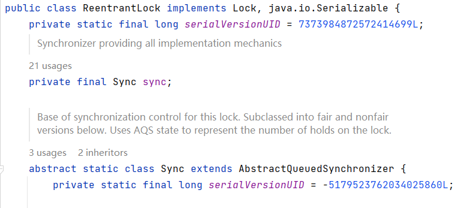

# **ReentrantLock**

## **lock()**

```java
ReentrantLock reentrantLock = new ReentrantLock();
reentrantLock.lock();
reentrantLock.unlock();
```

* lock()

```java
public void lock() {
        // sync是内部类，继承AQS类
        sync.lock();
    }
```



* sync.lock()，进入公平锁实现

```java
final void lock() {
       //  尝试直接加锁  
       acquire(1);
     }
```

* acquire(1)

```java
public final void acquire(int arg) {
        if (!tryAcquire(arg) &&
            acquireQueued(addWaiter(Node.EXCLUSIVE), arg))
            selfInterrupt();
    }
```

> 先尝试加锁，成功后返回，否则新建一个Node节点，入队等待获取锁

* tryAcquire(arg)

```java
protected final boolean tryAcquire(int acquires) {
            // 获取当前线程
            final Thread current = Thread.currentThread();
            // 获取当前资源状态
            int c = getState();
            // c == 0说明没有线程占用,尝试直接加锁
            if (c == 0) {
                if (!hasQueuedPredecessors() &&
                    // 加锁
                    compareAndSetState(0, acquires)) {
                    // 设置占有资源的线程
                    setExclusiveOwnerThread(current);
                    // 加锁成功
                    return true;
                }
            }
            // 说明有线程获取到了锁，判断是不是当前线程
            else if (current == getExclusiveOwnerThread()) {
                // 计算重入的次数
                int nextc = c + acquires;
                if (nextc < 0)
                    throw new Error("Maximum lock count exceeded");
                // 修改state的值
                setState(nextc);
                // 加锁成功
                return true;
            }
            // 加锁失败
            return false;
        }
    }
```

* hasQueuedPredecessors()

```java
public final boolean hasQueuedPredecessors() {
        // The correctness of this depends on head being initialized
        // before tail and on head.next being accurate if the current
        // thread is first in queue.
        Node t = tail; // Read fields in reverse initialization order
        Node h = head;
        Node s;
        return h != t &&
            ((s = h.next) == null || s.thread != Thread.currentThread());
    }
```

> false,当这个线程在队头或者队列为空；true，当有其他线程在排队且队列第一个元素不是当前线程。总之当队列为空，或者当前线程在队头的时候才允许尝试加锁

* addWaiter(Node mode)，新增一个Node，加入队尾

```java
private Node addWaiter(Node mode) {
        Node node = new Node(Thread.currentThread(), mode);
        // Try the fast path of enq; backup to full enq on failure
        Node pred = tail;
        // 队尾不为空，尝试将节点加入队尾，失败后自旋入队
        if (pred != null) {
            node.prev = pred;
            if (compareAndSetTail(pred, node)) {
                pred.next = node;
                return node;
            }
        }
        enq(node);
        return node;
    }
```

* enq(node);

```java
private Node enq(final Node node) {
        for (;;) {
            Node t = tail;
            // 队列为空，设置头结点为一个空节点，本节点为头结点的后继节点
            if (t == null) { // Must initialize
                if (compareAndSetHead(new Node()))
                    tail = head;
            } else {
                node.prev = t;
                // 尝试加入队尾
                if (compareAndSetTail(t, node)) {
                    t.next = node;
                    return t;
                }
            }
        }
    }
```

* acquireQueued(addWaiter(Node.EXCLUSIVE), arg)，新加的node自旋等待获取锁

```java
final boolean acquireQueued(final Node node, int arg) {
        boolean failed = true;
        try {
            boolean interrupted = false;
            for (;;) {
                final Node p = node.predecessor();
                // 节点的前置节点是头结点的时候，尝试获取锁
                if (p == head && tryAcquire(arg)) {
                    // 设置头结点为当前节点
                    setHead(node);
                    p.next = null; // help GC
                    failed = false;
                    // 设置中断为false
                    return interrupted;
                }
                // 获取锁失败后放弃自旋，等待前置节点唤醒
                if (shouldParkAfterFailedAcquire(p, node) &&
                    parkAndCheckInterrupt())
                    // 中断为true
                    interrupted = true;
            }
        } finally {
            if (failed)
                cancelAcquire(node);
        }
    }
```

> 获取不到锁的线程入队列，如果队列只有一个元素，会尝试获取一次锁，失败的话把他的waitStatus改为-1（初始化的时候都为0），表示后续的线程可以阻塞等待。

* shouldParkAfterFailedAcquire(p, node)

```java
private static boolean shouldParkAfterFailedAcquire(Node pred, Node node) {
        int ws = pred.waitStatus;
        // 检查前置节点的waitStatus是-1的话，说明前面还有人在等，返回true阻塞自身
        if (ws == Node.SIGNAL)
            /*
             * This node has already set status asking a release
             * to signal it, so it can safely park.
             */
            return true;
        // waitStatus大于0，向前寻找一个状态<=0的，其余的节点删除
        if (ws > 0) {
            /*
             * Predecessor was cancelled. Skip over predecessors and
             * indicate retry.
             */
            do {
                node.prev = pred = pred.prev;
            } while (pred.waitStatus > 0);
            pred.next = node;
        } else {
            /*
             * waitStatus must be 0 or PROPAGATE.  Indicate that we
             * need a signal, but don't park yet.  Caller will need to
             * retry to make sure it cannot acquire before parking.
             */
            // 设置前驱节点状态为-1，继续自旋，防止刚释放完锁，没人唤醒;这里如果只有一个节点的话，就是把自身设置成-1，只有不为0才有获得锁（被唤醒）的可能
            compareAndSetWaitStatus(pred, ws, Node.SIGNAL);
        }
        // 不需要阻塞，继续获取锁
        return false;
    }
```

> 只要前置节点为-1，后面的就只能等待，第一次设置为-1,还会再尝试获取一次锁

* parkAndCheckInterrupt()，调用LockSupport类阻塞自身

```java
private final boolean parkAndCheckInterrupt() {
        LockSupport.park(this);
        return Thread.interrupted();
    }
```

## **unlock()**

* reentrantLock.unlock()

```java
public void unlock() {
        sync.release(1);
    }
```

* release(int arg)，释放锁

```java
public final boolean release(int arg) {
        // 尝试释放锁
        if (tryRelease(arg)) {
            // 获取头结点，waitStatus不为0的话，表示后续节点可以获取锁了
            Node h = head;
            if (h != null && h.waitStatus != 0)
                unparkSuccessor(h);
            return true;
        }
        return false;
    }
```

> 会不会这边释放锁的时候，队列第一个节点waitStatus是0,然后阻塞了释放不了呢？第一次判断要park的时候，waitStatus从0改为-1，再自旋一次。如果直接阻塞，改为-1之前刚好释放了锁，没哟unpark线程线程会永远阻塞。

* tryRelease(arg)

```java
protected final boolean tryRelease(int releases) {
            // 改一下state的状态
            int c = getState() - releases;
            if (Thread.currentThread() != getExclusiveOwnerThread())
                throw new IllegalMonitorStateException();
            boolean free = false;
            // c为0，表示释放成功，修改锁拥有者
            if (c == 0) {
                free = true;
                setExclusiveOwnerThread(null);
            }
            // 设置state的值
            setState(c);
            return free;
        }
```

* unparkSuccessor(h)，使后面的线程解除阻塞

```java
private void unparkSuccessor(Node node) {
        /*
         * If status is negative (i.e., possibly needing signal) try
         * to clear in anticipation of signalling.  It is OK if this
         * fails or if status is changed by waiting thread.
         */
        // 头结点的状态为-1，设置为0
        int ws = node.waitStatus;
        if (ws < 0)
            compareAndSetWaitStatus(node, ws, 0);

        /*
         * Thread to unpark is held in successor, which is normally
         * just the next node.  But if cancelled or apparently null,
         * traverse backwards from tail to find the actual
         * non-cancelled successor.
         */
        // 从后往前找一个可以获取锁的Node
        Node s = node.next;
        if (s == null || s.waitStatus > 0) {
            s = null;
            for (Node t = tail; t != null && t != node; t = t.prev)
                if (t.waitStatus <= 0)
                    s = t;
        }
        // Node不为空的话，unpark线程
        if (s != null)
            LockSupport.unpark(s.thread);
    }
```

## **tryLock()**

```java
reentrantLock.tryLock(5,TimeUnit.MINUTES);
```

* **tryLock（）**

```java
public boolean tryLock(long timeout, TimeUnit unit)
            throws InterruptedException {
        return sync.tryAcquireNanos(1, unit.toNanos(timeout));
    }
```

> 带超时获取锁

* **tryAcquireNanos（）**

```java
public final boolean tryAcquireNanos(int arg, long nanosTimeout)
            throws InterruptedException {
        if (Thread.interrupted())
            throw new InterruptedException();
        // 同上
        return tryAcquire(arg) ||
            // 
            doAcquireNanos(arg, nanosTimeout);
    }
```

* **doAcquireNanos(int arg, long nanosTimeout)**

```java
private boolean doAcquireNanos(int arg, long nanosTimeout)
            throws InterruptedException {
        if (nanosTimeout <= 0L)
            return false;
        // 计算超时时间
        final long deadline = System.nanoTime() + nanosTimeout;
        // 添加节点到队列
        final Node node = addWaiter(Node.EXCLUSIVE);
        boolean failed = true;
        try {
            // 自旋尝试获取锁或者加入队列等待或者超时返回获取锁失败
            for (;;) {
                final Node p = node.predecessor();
                // 如果队列只有一个节点，进队的时候制定了，第一个节点的前继节点是自身
                if (p == head && tryAcquire(arg)) {
                    setHead(node);
                    p.next = null; // help GC
                    failed = false;
                    return true;
                }
                nanosTimeout = deadline - System.nanoTime();
                // 超时
                if (nanosTimeout <= 0L)
                    return false;
                if (shouldParkAfterFailedAcquire(p, node) &&
                    nanosTimeout > spinForTimeoutThreshold)
                    // LockSupport阻塞线程，指定时间
                    LockSupport.parkNanos(this, nanosTimeout);
                if (Thread.interrupted())
                    throw new InterruptedException();
            }
        } finally {
            if (failed)
                cancelAcquire(node);
        }
    }
```

> 在原来阻塞获取锁的基础上，阻塞指定的时间

